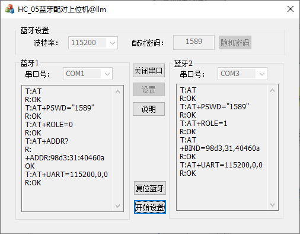

# HC_05蓝牙配对

标签： MFC C++

---

这是一个能够自动根据HC-05蓝牙配对指令对蓝牙进行设置的软件

 #### 软件截图
 

 #### 使用方法
 
 将两片HC-05蓝牙插入电脑的串口，完成软件设置，就可以完成配对。
 
 注意：使用该软件必须注册MSCOMM32.OCX控件，否则无法打开。

 #### 控件安装

- 1.将“控件”压缩包中的MSCOMM32.OCX复制到`C:\Windows\SysWOW64\`（64位电脑）目录下,或者 `C:\Windows\System32\`（32位电脑）目录下

- 2.以管理员身份运行cmd.exe

- 3.输入指令`regsvr32 %windir%\SysWOW64\MSCOMM32.OCX`（64位电脑)
或者 `regsvr32 %windir%\System32\MSCOMM32.OCX`（32位电脑）

#### 工程

Visual Studio 2019
